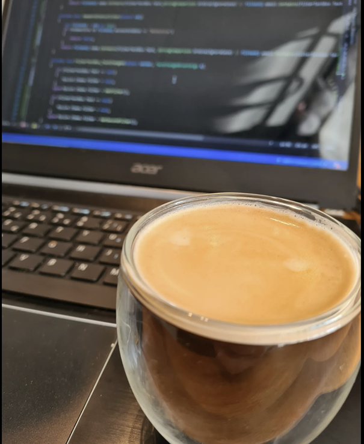

# 🎓 Me-sida – MVC-kursen



Detta är mitt projekt i kursen **ramverk1 (mvc)** på BTH.

## 📚 Innehåll

- Startsida med personlig presentation
- About-sida med kursinfo
- Redovisningssida 
- Lucky-sida med tärning
- JSON API med citat

## Repo  
🔗 [Se projektet på GitHub](https://github.com/jojjan-johansson/mvc-kmom01)

## Instruktioner för att komma igång

```bash
git clone git@github.com:användarnamn/mvc-me-report.git
cd mvc-me-report/app
symfony server:start
